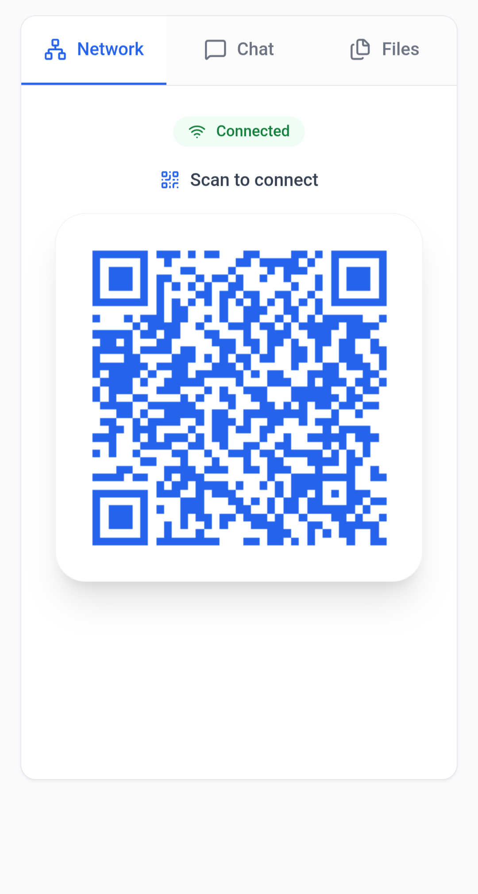
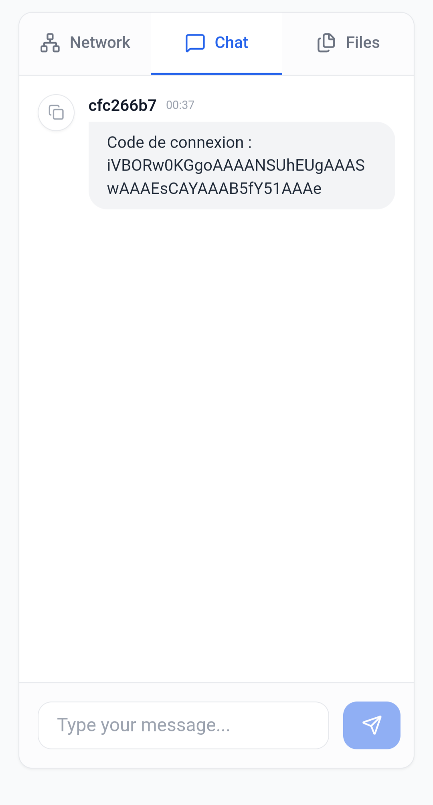
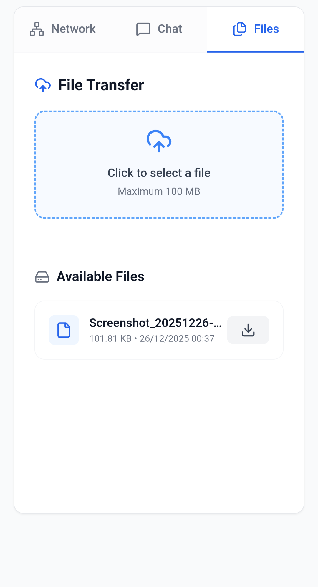

# LAN Share

File sharing and real-time chat application for local WiFi networks. 
> Because I'm iPhone poor.

<table align="center" width="100%">
  <tr>
    <td align="center" width="33%">
      <br/>
    </td>
    <td align="center" width="33%">
      <br/>
    </td>
    <td align="center" width="33%">
      <br/>
    </td>
  </tr>
</table>

## Features

- 🔐 **QR Code UUID Authentication** (automatically generated unique token)
- 💬 Real-time chat between connected devices
- 📁 File transfer

## Prerequisites

### Option 1: Standalone
- **Bun** runtime: [Install Bun](https://bun.sh/)
  ```bash
  curl -fsSL https://bun.sh/install | bash
  ```

### Option 2: Docker
- **Docker** and **Docker Compose**: [Install Docker](https://docs.docker.com/get-docker/)

<br/>

# Usage

1. **Start**: `./start.sh or ./start-docker.sh`
2. **On your Computer**: Open `http://localhost:3009`
3. **On your mobile**: Scan the QR code displayed on the Computer
4. **Chat & Files**: Exchange text or files

## Architecture


- **Backend**: Hono with WebSocket
- **Frontend**: React + Vite
- **Runtime**: Bun

## Security

- Mandatory authentication with unique token
- Connection limited to local network
- No persistent data storage (memory only)